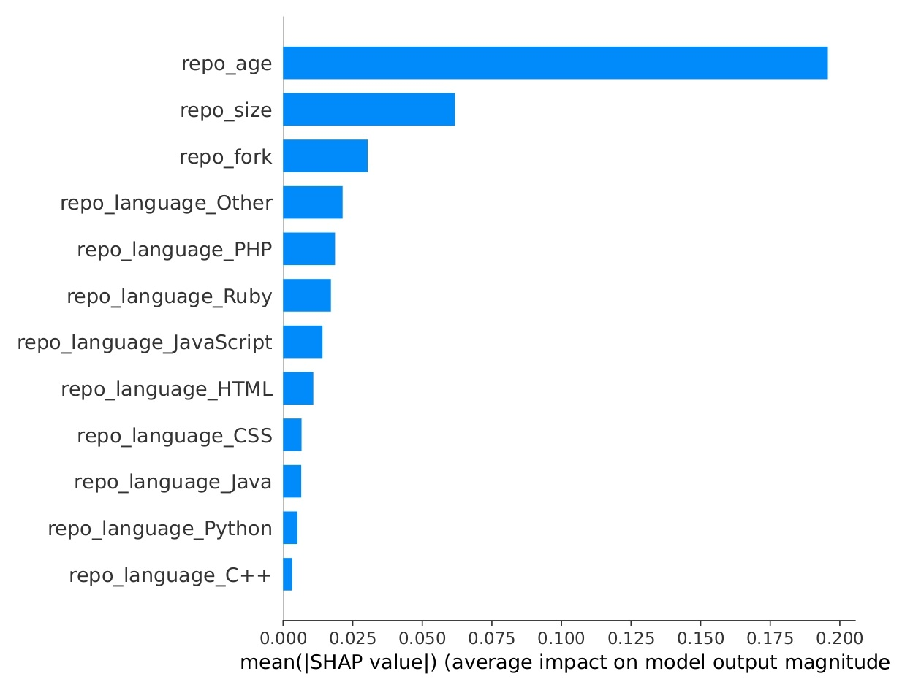
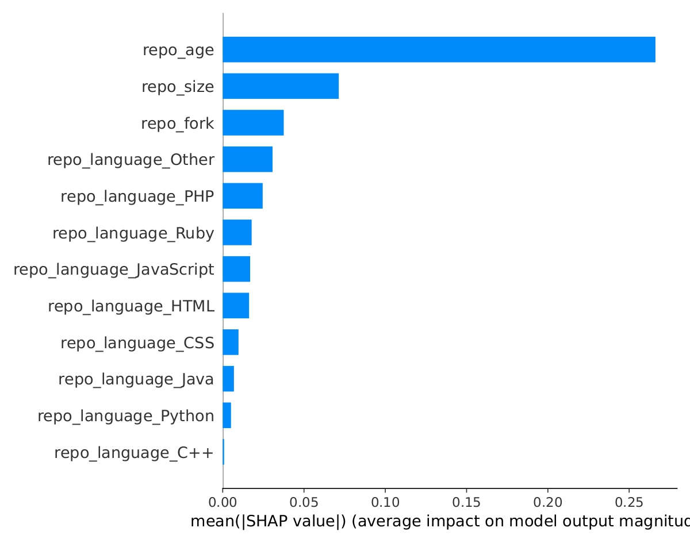

# Development Consistency of Popular Repos

Social Media Mining Final Project

[Paper](https://www.overleaf.com/read/bxmcdzdsrvbm#528d8b)

# Stars, Suspicion, and Stability: Defining Success in GitHub Repositories

**Hashem Al Sailani** | **Fatemah Elsewaky** | **Robin Emmanuel Sardja** | **Kathryn Bodden** | **Nathan Allen** | **Raiyan Abdul Baten**

Department of Computer Science and Engineering

University of South Florida

{halsailani, fatemahelsewaky, resardja, boddenk, allen243, rbaten}@usf.edu

## Abstract

In the dynamic landscape of open source software development on GitHub, understanding the nuances between repository popularity and success becomes essential. This study examines various GitHub repositories and user behaviors to discern the dynamics of repository popularity, the markers of success, and the detection of false actors within the platform. Initially, we explore the characteristics of popular and successful repositories, finding that the factors contributing to success and popularity are not identical. Popularity is quantified by the number of stars, commonly used in previous studies, while success is defined in terms of a project's state-of-the-art claims. Our investigation reveals only a low positive correlation between development consistency, measured through commit activities, and repository stars, suggesting that regular updates alone do not guarantee popularity. Furthermore, we delve into the detection of false actors within the community, analyzing their characteristics and the potential impact on repository metrics. Our results align with prior findings in identifying suspicious behaviors, enhancing understanding of how authenticity affects repository evaluations. However, our research faced limitations, including the inability to apply methods across the entire dataset and difficulties in discerning connections within the network of interactions. Despite these challenges, our findings provide valuable insights into the factors that can enhance repository success, popularity, and credibility on GitHub.

Index Terms - Social Media, GitHub, Popularity, Success, Consistency

## Motivation

In the GitHub community, popularity is often equated with the number of stars a repository receives, serving as a social endorsement that suggests a project's perceived usefulness and quality. These stars operate similarly to "likes" on social media platforms and are a primary indicator for users to gauge which projects warrant attention. However, this study aims to critically assess whether this measure of popularity correlates with ‘success’ in open source projects. Success in these projects can extend to include factors like the impact on the software community, or the achievement of specific, innovative goals. This raises a crucial question about the divergence between popularity and actual success, and whether popular repositories consistently deliver on these broader success metrics.

By exploring the nuanced dynamics between what is considered successful  and actual project outcomes, we aim to provide insights into effective project development and community engagement on GitHub. As such, the following research questions will tackle key aspects of repository success, user authenticity, and development consistency:
1. What are the characteristics of popular & successful repositories?
2. How can we determine false actors? What makes a GitHub user suspicious?
3. How can development consistency affect repository popularity?

## Literature Review

### Stars and Popularity

GitHub, as the largest platform for open source collaboration, features several social coding attributes that significantly influence project popularity, particularly the ability for users to "star" repositories to express approval or interest [1][2][3]. Borges et al. have extensively studied the factors influencing the accumulation of these stars, identifying key influences such as the programming language used, application domain, and the introduction of new features [1]. Their analysis of 2,279 repositories delineates four patterns of popularity growth, providing strategic insights for developers [2].

Expanding on this, Borges et al. used multiple linear regressions to forecast the number of stars a repository might receive. They demonstrated that these models perform optimally with data from the past six months, emphasizing the competitive nature of software development [2]. They further investigated the motivations behind starring projects and found that a significant majority of developers consider star counts before engaging with a project, underscoring the practical and psychological impacts of this feature [3].

Additional measures such as forks and open issues are crucial to comprehensively measure repository popularity. Forks represent an essential dimension of collaboration, often indicating a repository's influence and community engagement. Brisson et al. studied communication within "software families" on GitHub, finding that the depth of forks, the cross-collaboration among repositories, and familial pull requests significantly correlate with higher star counts [4]. This study highlights the intricate communication networks that evolve within forked repositories and their impact on a repository's visibility and popularity.

Open issues also play a critical role in determining a repository's health and activity. Bissyandé et al. conducted a large-scale investigation of issue trackers on GitHub and identified a correlation between the activity in issue trackers and the success of software projects [5]. They demonstrated that active participation in issue reporting and resolution can significantly impact a repository's popularity and perceived reliability.

### Suspicious Accounts

Previous work has utilized various methods to identify unusual GitHub user behaviors. One study employed the DBSCAN clustering method to analyze commit timing and locations [6], while another analyzed comments in pull requests, focusing on the presence of empty and non-empty comments and their patterns to detect bots [7]. Building on these approaches, our research extends beyond these analyses to consider additional metrics such as follower-to-following ratios, account creation dates, activity durations, and profile completeness. Our findings suggest that false actors display markedly different activity and account behavior compared to genuine users, thus confirming our hypothesis and broadening the understanding of how to identify suspicious actors on GitHub.

### Development Consistency

Previous studies have investigated the relationship between commit frequency and GitHub repository popularity, but found no compelling correlation [9]. We argue that commit frequency overemphasizes the significance of isolated peaks of "crunch-time development" relative to the broader development timeline. By focusing on development consistency as a correlate of repository popularity, we aim to mitigate the influence of these intensive bursts while appropriately accounting for periods of inactivity (development hiatuses).

## Data

This research utilizes two comprehensive datasets to explore the multifaceted factors influencing GitHub repository popularity. The first dataset, "A Representative User-centric Dataset of 10 Million GitHub Developers" by Gong et al., is a user-centric JSON file approximately 50 GB in size, detailing the GitHub activities of 10 million developers. It includes nested objects such as ```repo_list``` and ```commit_list```, allowing for an in-depth analysis of user behaviors and their contributions to repository popularity [10].

The second dataset, "GitHub Public Repository Metadata," sourced from Kaggle and compiled by Pelmers, contains metadata for about 3.1 million GitHub repositories. This repository-centric dataset provides broad information about repository attributes, facilitating an understanding of how repository characteristics like the main language, update frequency, and documentation presence influence their popularity within the GitHub community [11].

Both datasets are preprocessed for consistency and to enable combined analysis. From the user-centric dataset, relevant fields are extracted from nested JSON structures to focus on user engagement metrics hypothesized to impact repository popularity. For the repository-centric dataset, data cleaning is performed to remove incomplete records and standardize categorical variables for easier comparison and analysis.

By analyzing these datasets, we aim to identify and quantify the influences on GitHub repository popularity and success, providing comprehensive and actionable insights for developers and project managers in the open source community.

## Methodology

### Prediction Technique

Our study utilizes multiple linear regression to predict three primary indicators of GitHub repository popularity: annual stars, annual forks, and open issues per year. These indicators are treated as separate dependent variables in our models. The independent variables are derived from a comprehensive set of features that characterize repository attributes, with the inclusion of a manually created 'age' feature representing the maturity of the repository. The regression model for each dependent variable $Y_{k}$ is formulated as follows:

$$
Y_{k} = b_0 + b_1X_1 + b_2X_2 + \ldots + b_rX_r
$$

Here, $Y_{k}$ signifies the k-th dependent variable (stars, forks, or issues per year), $X_i$ are the independent variables from our assembled feature set, and $b_j$ are the regression coefficients. This structured approach allows us to quantitatively assess the influence of various repository characteristics on its popularity metrics.

### Estimating the Errors

To determine the accuracy of our models, we calculate the Relative Squared Error (RSE) for each prediction. For a repository $r$, let $N_k(r)$ be the actual observed value of the k-th dependent variable, and $Nb_k(r)$ the corresponding predicted value derived from our regression model. The RSE for each dependent variable is computed as follows:

$$
RSE_k = \left( \frac{Nb_k(r)}{N_k(r)} - 1 \right)^2
$$

To evaluate the overall performance of our models across the dataset, we compute the mean Relative Squared Error (mRSE) for each dependent metric, defined as the arithmetic mean of the RSE values across all evaluated repositories:

$$
mRSE_k = \frac{1}{|R|} \sum_{r \in R} \left( \frac{Nb_k(r)}{N_k(r)} - 1 \right)^2
$$

In this formula, $y_i$ denotes the dependent variable vector, $X_i$ represents the matrix of input features, $\beta$ are the coefficients, and $\lambda$ is the regularization parameter that controls the extent of sparsity in the coefficient vector $\beta$. The objective is to minimize the residual sum of squares subject to a penalty on the absolute size of the coefficients. This penalty term encourages the solution to have fewer non-zero coefficients, effectively reducing the number of features in the model.

### Feature Selection

To optimize the input feature set for predicting the annual metrics of stars, forks, and open issues on GitHub repositories, LASSO Regression (Least Absolute Shrinkage and Selection Operator) was utilized. LASSO Regression serves as both a regularization and variable selection technique, which helps in enhancing the predictiveness of the regression model while simultaneously reducing the complexity.

The mathematical formulation for LASSO Regression is represented as:

$$
\min_{\beta} \left( \frac{1}{2n} \sum_{i=1}^{n} (y_i - X_i \beta)^2 + \lambda \sum_{j=1}^{p} |\beta_j| \right)
$$

In this formula, $y_i$ denotes the dependent variable vector, $X_i$ represents the matrix of input features, $\beta$ are the coefficients, and $\lambda$ is the regularization parameter that controls the extent of sparsity in the coefficient vector $\beta$. The objective is to minimize the residual sum of squares subject to a penalty on the absolute size of the coefficients. This penalty term encourages the solution to have fewer non-zero coefficients, effectively reducing the number of features in the model.

### SoTA Classification

The classification of state-of-the-art (SoTA) claiming GitHub repositories involves several computational steps to handle and analyze textual data effectively. Below we outline the methodological process employed in our study, detailing each step under sub-headings.

#### Data Preparation

The initial step in our analysis involves creating a standardized list of common machine learning (ML) phrases. This list is utilized to filter and focus the textual content of repository descriptions. These descriptions are then subjected to tokenization, a process where text is broken down into its constituent tokens (words or phrases). We employed the model "sentence-transformers/all-mpnet-base-v2" to remove non-essential words, commonly referred to as fluff words, enhancing the relevance of the textual data for further processing.

$$
T_d = \text{Tokenize}(D, \text{model})
$$

Where $T_d$ represents the tokenized description, and $D$ is the original repository description. The tokenization model aids in refining the content to features more pertinent to our analytical goals.

#### Embedding Conversion + Similarity Score

Following pre-processing, the tokenized repository descriptions $T_d$ and the ML phrases are transformed into embeddings. Embeddings are high-dimensional vectors that capture semantic meanings of the text, allowing computational models to process text-based data effectively. We utilized techniques that convert text into vector space models, where the proximity of vectors indicates semantic similarities:

$$
E_r = \text{Embed}(T_d)
$$

$$
E_m = \text{Embed}(M)
$$

where $E_r$ is the embedding of the repository description and $E_m$ is the embedding of ML phrases. The embeddings are then compared using cosine similarity, a metric used to measure how similar the documents are irrespective of their size.

$$
\text{Cosine Similarity} = \frac{E_r \cdot E_m}{|E_r| |E_m|}
$$

This measure helps in identifying repositories whose descriptions are semantically close to common ML phrases, suggesting potential SoTA claims.

#### Contextual Tagging using AI

To classify repositories as claiming state-of-the-art status, we leveraged the gpt3.5 turbo API. This advanced AI tool assists in tagging by analyzing the context of repository descriptions and aligning them with our predefined criteria for SoTA claims.

$$
\text{Tags} = \text{AI}_{\text{tag}}(E_r, \text{GPT-3.5 Turbo})
$$

Where $\text{Tags}$ are the labels assigned by the AI based on the analysis of the embeddings $E_r$ under the guidance of GPT-3.5 Turbo's contextual understanding capabilities.

#### Handling Class Imbalance

The datasets used for classifying SoTA and non-SoTA repositories exhibited a pronounced class imbalance, with SoTA-claiming repositories making up 30% of Dataset 2 and 20% of Dataset 1. To mitigate this imbalance and enhance model performance, we have now adopted the method of applying class weights directly in the model training process. This approach adjusts the importance assigned to each class during the training of the machine learning model, compensating for imbalances by assigning higher weights to the minority class and lower weights to the majority class [12].

The mathematical basis for class weights can be formulated as follows:

$$
w_j = \frac{N}{k \times n_j}
$$

where $w_j$ is the weight for class $j$, $N$ is the total number of samples in the dataset, $k$ is the number of classes, and $n_j$ is the number of samples in class $j$. By applying these weights, the loss function during training is adjusted so that errors in predicting the minority class have a larger impact compared to the majority class. This effectively increases the cost of misclassifying the minority class, allowing the model to pay more attention to it.

### Model Interpretation

In the analysis of predictive models, understanding the influence of each feature on the predicted outcomes is crucial. Our approach to model interpretation encompasses both the visualization of input feature weights and the application of Shapley Additive exPlanations (SHAP) values to provide a more nuanced understanding of model behavior.

#### Visualizing Feature Weights
Feature weights are fundamental to interpreting the traditional linear models where each weight represents the strength and direction of the relationship between a feature and the outcome. By analyzing these weights, one can determine which features are most influential, and how changes in those features are expected to impact the predicted results. The positive or negative sign of each weight indicates whether the feature contributes positively or negatively to the outcome, respectively.

$$
\text{Influence} = \beta_i \times \text{Feature}_i
$$

Where \(\beta_i\) is the weight associated with the \(i\)-th feature. This method is straightforward and provides a direct interpretation but is limited to linear associations.

#### Shapley Additive exPlanations (SHAP) Values

To overcome the limitations of basic feature weight interpretation, we employed SHAP values, which offer a more comprehensive insight into the contribution of each feature across a complex model's predictions. SHAP values are derived from game theory, specifically from the concept of Shapley values, which distribute the "payout" (prediction effect) among the "players" (features) [13].

The key difference between SHAP and traditional feature importance is that SHAP considers the interaction effects between features. It provides a value for each feature for each prediction, indicating how much each feature contributed, positively or negatively, to that specific prediction. This is particularly useful in models where interactions or non-linearities obscure the effects of individual features.

$$
\phi_i = \sum_{S \subseteq N \setminus \{i\}} \frac{|S|!(|N|-|S|-1)!}{|N|!} \left[v(S \cup \{i\}) - v(S)\right]
$$

Where $\phi_i$ is the SHAP value for feature $i$, $S$ is a subset of features excluding $i$, $N$ is the total set of features, and $v$ is the model's prediction function.

### Suspicious User Analysis

To systematically analyze the dataset comprising approximately 500,000 users across 20 CSV files, we implemented a chunking technique to efficiently process 50,000 rows from each file sequentially. Subsequently, we performed random sampling to select 5,000 users from each file, which we then aggregated into a structured DataFrame for in-depth analysis. Utilizing Python libraries, specifically Pandas [14] for data manipulation and both Matplotlib [15] and Seaborn [16] for data visualization, we conducted comparative analyses of behavioral patterns between suspicious and non-suspicious accounts. Key metrics examined included follower-to-following ratios and commit frequencies. Moreover, we investigated temporal aspects of the accounts, comparing account creation times with the dates of last activity to gauge the duration of account activity. We also assessed the completeness of user profiles to identify any characteristic patterns indicative of suspicious activities. These methodologies enabled us to discern distinct behavioral signatures associated with suspicious accounts, thereby validating our analytical framework against established benchmarks in the domain.

### Commit Analysis

In this study, we investigate the correlation between development consistency and popularity in GitHub repositories. We quantify development consistency through the standard deviation of the intervals between consecutive commits, with lower values indicating more regular update patterns and higher values suggesting irregular, sporadic activity. This metric helps in identifying patterns of "crunch-time development," characterized by bursts of intense activity, and "development hiatuses," marked by prolonged inactivity.

Popularity is assessed by the number of stars a repository receives, which reflects user interest and engagement. Stars not only indicate a user's interest in following repository updates but also influence GitHub's content recommendation algorithms, enhancing visibility.
The analysis involved preprocessing a user-centric dataset, where repositories were extracted from individual user profiles into a unified list annotated with star counts. We derived the standard deviation of commit intervals for each repository from commit timestamps, standardized to UTC. These intervals were sorted chronologically to calculate the time differences between consecutive commits.

Due to computational constraints, the dataset was divided into twenty uniform subsets and one smaller subset for manageable processing. These subsets were stored as JSON files and designed to be recombined flexibly, allowing for scalable analysis depending on available computational resources.
Correlation analysis was conducted by plotting repositories with their star counts on the x-axis against the standard deviation of commit intervals on the y-axis. Initial observations suggested a power-law distribution, prompting a replotting on logarithmic scales to better discern potential correlations. We computed Pearson, Spearman, and Kendall correlation coefficients to assess the strength and significance of the observed relationships.

## Results

### Q1: What are the characteristics of popular & successful Repositories?

This section delves into the analysis of GitHub repositories to discern the underlying characteristics that define their popularity and success. We assess this through predictive modeling, examining both popularity metrics (stars, forks, issue counts) and success classifications.

#### Popularity

For the popularity assessment, our primary objective is to predict the number of stars, forks, and open issues. These metrics serve as indicators of a repository's popularity. Our modeling approach includes XGBoost, Linear Regression, and Random Forest. These models were chosen for their varying abilities to handle linear and non-linear relationships within the data.

In our analysis, we established a baseline for comparison by using a simple model that always predicts the median value of the target feature from the training dataset. This baseline model does not involve linear regression but is rather a method of measuring central tendency. We evaluated the performance of this model using the Root Mean Square Error (RMSE), which quantifies the average magnitude of the prediction error. The $R^2$ score, which measures the proportion of variance in the target variable that is predictable from the features, was then calculated to assess how effectively this baseline model captures the variability in the observed outcomes.

The results of this comparison are captured in Table I - IV, which detail the models' performances using $R^2$ score and confidence intervals for Dataset 1 and Dataset 2, respectively. Figures and tables representing the overlapping input features between both datasets will be indicated by an asterisk symbol (*). They form the basis of our evaluations, allowing for a direct and consistent comparison of the models under standardized conditions. This approach underscores the robustness and generalizability of the models. Table V - VI complements this by showcasing the performance of all models utilizing all available input features in Dataset 2.

<div align="center">

Table 1: Model's regression performance on Dataset 1 for Stars and Forks, by $R^2$ score*

| Model              | Stars (%)              | Forks (%)             |
|--------------------|------------------------|-----------------------|
| Baseline Model     | -3.75% ± 0.18%         | -8.18% ± 0.40%        |
| Linear Regression  | 19.42% ± 0.51%         | 17.87% ± 0.38%        |
| XGBoost            | **21.20% ± 0.36%**     | **19.69% ± 0.50%**    |

Table 2: Model's regression performance on Dataset 1 for Issues, by $R^2$ score*

| Model              | Issues (%)             |
|--------------------|------------------------|
| Baseline Model     | -15.71% ± 0.45%        |
| Linear Regression  | 10.42% ± 0.31%         |
| XGBoost            | **13.03% ± 0.39%**     |

Table 3: Model's regression performance on Dataset 2 for Stars and Forks, by $R^2$ score*

| Model              | Stars (%)              | Forks (%)             |
|--------------------|------------------------|-----------------------|
| Baseline Model     | -10.94% ± 0.09%        | -1.08% ± 0.02%        |
| Linear Regression  | 14.52% ± 0.15%         | 18.36% ± 0.21%        |
| XGBoost            | **16.34% ± 0.10%**     | **19.85% ± 0.12%**    |

Table 4: Model's regression performance on Dataset 2 for Issues, by $R^2$ score*

| Model              | Issues (%)             |
|--------------------|------------------------|
| Baseline Model     | -9.53% ± 0.06%         |
| Linear Regression  | 24.18% ± 0.12%         |
| XGBoost            | **27.65% ± 0.13%**     |

Table 5: Model's regression performance on Dataset 2 for Stars and Forks, by $R^2$ score

| Model              | Stars (%)              | Forks (%)             |
|--------------------|------------------------|-----------------------|
| Baseline Model     | -10.95% ± 0.09%        | -1.09% ± 0.03%        |
| Linear Regression  | 44.76% ± 0.12%         | 45.76% ± 0.18%        |
| XGBoost            | **49.63% ± 0.15%**     | **54.72% ± 0.14%**    |

Table 6: Model's regression performance on Dataset 2 for Issues, by $R^2$ score

| Model              | Issues (%)             |
|--------------------|------------------------|
| Baseline Model     | -9.51% ± 0.09%         |
| Linear Regression  | **50.70% ± 0.13%**     |
| XGBoost            | 49.78% ± 0.23%         |

</div>

To verify the robustness of our results, we used ten different random seeds, ranging from 20 to 32. For each seed, the dataset was partitioned into training and testing sets using the ```random_state``` parameter set to the corresponding seed value. This ensured that each loop's train-test split was consistent with the seed, allowing for reliable training and evaluation of the model across varied data splits.

### A. SHAP Value Analysis

<div align="center">



Fig 1. XGBoost SHAP values on Dataset 1*



Fig 2. Linear Regression SHAP values on Dataset 1

</div>

## References

1. H. Borges, A. Hora, and M. T. Valente, "Understanding the Factors That Impact the Popularity of GitHub Repositories," 2016 IEEE International Conference on Software Maintenance and Evolution (ICSME), Raleigh, NC, USA, 2016, pp. 334-344.
2. Borges, Hudson, Hora, Andre, and Valente, Marco Tulio, "Predicting the Popularity of GitHub Repositories," Proceedings of the The 12th International Conference on Predictive Models and Data Analytics in Software Engineering, PROMISE 2016.
3. Hudson Borges and Marco Tulio Valente, "What’s in a GitHub Star? Understanding Repository Starring Practices in a Social Coding Platform," Journal of Systems and Software, vol. 146, pp. 112-129, 2018.
4. S. Brisson, E. Noei, and K. Lyons, "We Are Family: Analyzing Communication in GitHub Software Repositories and Their Forks," 2020 IEEE 27th International Conference on Software Analysis, Evolution and Reengineering (SANER), London, ON, Canada, 2020, pp. 59-69.
5. T. F. Bissyandé, D. Lo, L. Jiang, L. Réveillère, J. Klein and Y. L. Traon, "Got issues? Who cares about it? A large scale investigation of issue trackers from GitHub," 2013 IEEE 24th International Symposium on Software Reliability Engineering (ISSRE), Pasadena, CA, USA, 2013, pp. 188-197.
6. "Author Risk: Bad Actors in GitHub," Phylum Blog, 2021. [Online]. Available: https://blog.phylum.io/author-risk-bad-actors-in-github/
7. M. Golzadeh, A. Decan, D. Legay, T. Mens, "A ground-truth dataset and classification model for detecting bots in GitHub issue and PR comments," Journal of Systems and Software, vol. 175, 2021, 110911, ISSN 0164-1212, DOI: https://doi.org/10.1016/j.jss.2021.110911. [Online]. Available: https://www.sciencedirect.com/science/article/pii/S016412122100008X
8. F. Johansson, A. Rozental, K. Edlund, P. Côté, T. Sundberg, C. Onell, A. Rudman, and E. Skillgate, "Associations between procrastination and subsequent health outcomes among university students in Sweden," JAMA Network Open, vol. 6, no. 1, e2249346, 2023. [Online]. Available: https://doi.org/10.1001/jamanetworkopen.2022.49346
9. M. Grönlund and J. Jefford-Baker, "Measuring correlation between commit frequency and popularity on GitHub," 2017.
10. Gong, Qingyuan; Zhang, Jiayun; Chen, Yang; Xiao, Yu; Fu, Xiaoming; Hui, Pan; Li, Xiang; Wang, Xin, 2018, "A Representative User-centric Dataset of 10 Million GitHub Developers", Harvard Dataverse, V1, DOI: 10.7910/DVN/T6ZRJT.
11. Pelmers. "GitHub Public Repository Metadata with 5 Stars." Kaggle, 2021. Available: https://www.kaggle.com/datasets/pelmers/github-repository-metadata-with-5-stars
12. B. Bakırarar and A. ELHAN, "Class Weighting Technique to Deal with Imbalanced Class Problem in Machine Learning: Methodological Research," Turkiye Klinikleri Journal of Biostatistics, vol. 15, pp. 19-29, Jan. 2023, doi: 10.5336/biostatic.2022-93961.
13. S. M. Lundberg and S.-I. Lee, "A unified approach to interpreting model predictions," in Proc. of the 31st Int. Conf. on Neural Information Processing Systems (NIPS'17), Long Beach, California, USA, 2017, pp. 4768–4777.
14. W. McKinney, "Data Structures for Statistical Computing in Python," in Proc. of the 9th Python in Science Conference, 2010, pp. 445-451.
15. J. D. Hunter, "Matplotlib: A 2D Graphics Environment," Computing in Science & Engineering, vol. 9, no. 3, pp. 90-95, 2007.
16. M. Waskom et al., "Seaborn: statistical data visualization," Journal of Open Source Software, vol. 6, no. 60, p. 3021, 2021.
17. T. Park and S. Vanroekel, “Introducing: Project Open Data,” National Archives and Records Administration, https://obamawhitehouse.archives.gov/blog/2013/05/16/introducing-project-open-data (accessed Apr. 28, 2024).
18. “Microsoft to acquire GitHub for $7.5 billion,” Microsoft News Center, https://news.microsoft.com/2018/06/04/microsoft-to-acquire-github-for-7-5-billion/ (accessed Apr. 28, 2024).
19. H. Shah, “How github democratized coding and found a new home at Microsoft,” Nira Blog, https://nira.com/github-history/ (accessed Apr. 28, 2024).
